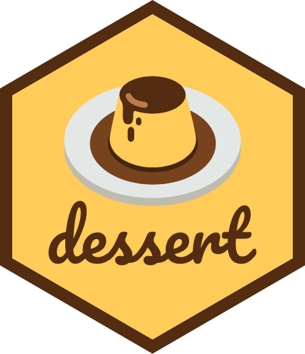

<!-- README.md is generated from README.Rmd. Please edit that file -->
<!-- badges: start -->

<!-- badges: end -->

# dessert 

Your favourite analysis recipe should always be followed by your
favourite dessert!

------------------------------------------------------------------------

## Development

We invite everyone to join the development for this package. You can
view the progress and open issues and/or actions in the
[`Have some dessert Project`](https://github.com/users/gerkovink/projects/2).
Please adopt the folowing contribution workflow:

1.  Fork this repo
2.  In your own fork, create a new branch
3.  Work in your new branch
4.  Submit a pull-request to `dessert:main` for review

------------------------------------------------------------------------

## Funding

This project has been funded by the 2022 Open Science Fund at Utrecht
University. The repository with the Fund application form [can be found
here](https://github.com/gerkovink/OpenScienceFund2022).

------------------------------------------------------------------------

## Acknowledgement

Thanks to Ernst Paul for creating the delicious hexagon.

------------------------------------------------------------------------

