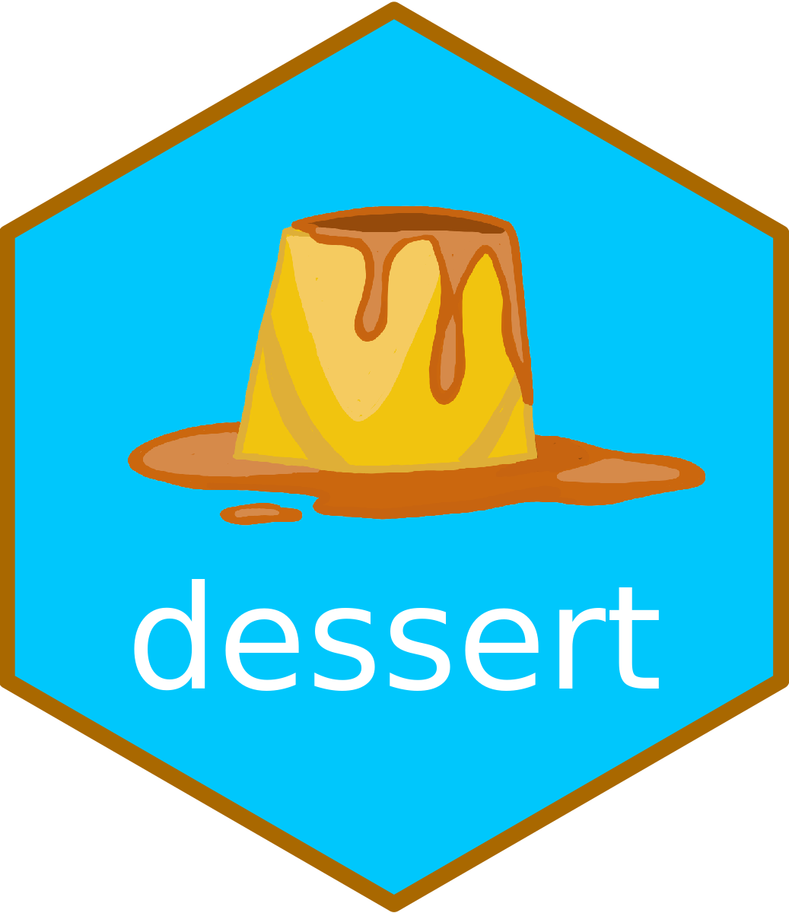

# dessert 
Your favourite analysis recipe should always be followed by your favourite dessert!

---

This project has been funded by the 2022 Open Science Fund at Utrecht University. The repository with the Fund application form [can be found here](https://github.com/gerkovink/OpenScienceFund2022). 

---

